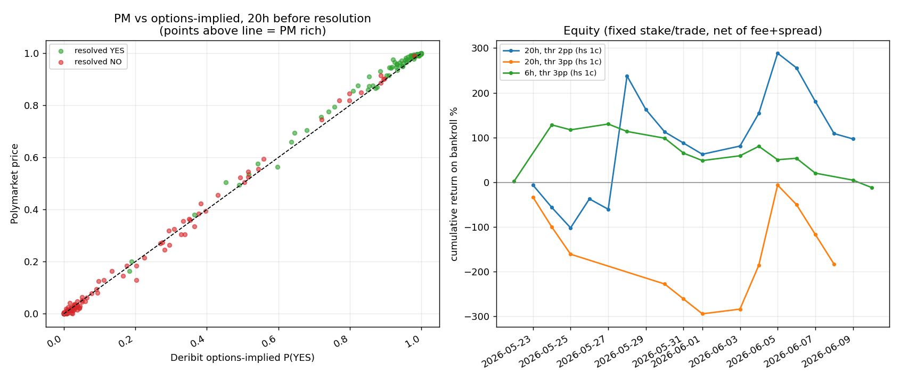

# Crypto digitals vs Deribit — A1 validation backtest

**Question:** Strategy A1 (the flagship from `STRATEGY_CANDIDATES.md`) claims Polymarket's
daily "BTC/ETH above $K at noon ET" digitals diverge from the Deribit options-implied
probability by enough to trade. A live one-day proof-of-concept measured PM 3–6pp rich
near-the-money. Does the edge survive a real backtest with correct vol measurement,
settlement-time alignment, and costs?

**Answer: No — A1 fails validation.** Over the entire life of the daily product, PM and
Deribit agree tightly; no threshold/cost configuration produces a statistically
significant profit; the model is not sharper than Polymarket (Brier ~tied); and the
trades the strategy would take with the most conviction (largest gaps) were the ones
where *the model* was wrong.

## Data

- **Universe:** every resolved daily event of the product's existence —
  **2026-05-22 → 2026-06-10** (20 days; the product launched May 22), BTC + ETH,
  40 events, 477 strike-markets, **913 comparable (PM, model) observations**.
- **Polymarket:** Gamma resolved outcomes; CLOB 10-min price history; live order books
  (for the cost model: median bid-ask spread on these ladders ≈ **2¢ in the body**).
- **Deribit:** historical option *trades* with per-trade IV from `history.deribit.com`,
  ±90 min around each decision time (~300–550 trades/window).
- **Binance** 1-minute closes (the index PM actually resolves on) for spot.

## Method

Two decision times per market: **20h before resolution** (D-1 20:00 UTC) and **6h before**
(D 10:00 UTC). Per decision: fit an IV smile per expiry (quadratic in log-moneyness,
clamped at the traded strike range), then compute the digital `N(d2)` with **total-variance
interpolation between the two Deribit expiries bracketing PM's 16:00 UTC resolution** —
i.e. the settlement-clock mismatch that inflated the PoC is handled. (At 6h only the
next-day expiry exists → flat-vol extrapolation, flagged.) Trade rule: buy the cheap side
when |PM − model| > threshold, at mid + half-spread + the current crypto taker fee
(`0.07·c·(1−c)`). Fixed stake per trade; bankroll = max concurrent daily deployment.

## Findings



**1. PM ≈ Deribit.** The scatter hugs the diagonal across the whole probability range.
Mean body-row gap: PM 0.530 vs model 0.518 (+1.2pp) — far below the PoC's 3–6pp, which
was inflated by nearest-strike IV and no settlement alignment. The structural sign (PM
slightly rich in the body) exists but is roughly the size of the bid-ask spread.

**2. No configuration is significantly profitable** (and the surface is incoherent):

| decision | threshold | n | hit | mean/trade (net, hs=1¢) | t-stat |
|---|---|---|---|---|---|
| 20h | 2pp | 43 | 37% | +9.0% | 0.29 |
| 20h | 3pp | 23 | 26% | −23.9% | −0.72 |
| 20h | 5pp | 4 | **0%** | **−100%** | — |
| 6h | 2pp | 38 | 68% | −0.9% | −0.04 |
| 6h | 3pp | 30 | 60% | −2.4% | −0.08 |
| 6h | 5pp | 14 | 57% | +24.1% | 0.41 |

Every |t| < 1. The sign flips non-monotonically with threshold — the signature of noise,
not of an edge that strengthens with signal size.

**3. The largest gaps were model error, not PM error.** Gap-bucket table (20h):

| PM − model | n | mean PM | mean model | realized |
|---|---|---|---|---|
| −5pp … −2pp | 7 | 0.309 | 0.339 | 0.143 |
| −2pp … +2pp | 50 | 0.454 | 0.450 | **0.360** |
| +2pp … +5pp | 32 | 0.687 | 0.655 | 0.531 |
| > +5pp | 3 | 0.764 | 0.710 | **1.000** |

When PM and the model disagreed by >5pp, the markets *all resolved YES* — PM was right,
the model (smile wing / microstructure) was wrong. High-conviction A1 trades go 0-for-4.

**4. The window is drift-contaminated, which flatters the NO side.** BTC fell ~14% over
the 20 days; realized frequency (0.419) sat ~10pp below *both* venues' pricing — including
in the zero-gap bucket where the model agrees with PM (realized 0.360 vs PM 0.454). Any
apparent profit from buying NO in this window is directional luck shared by both venues,
not model skill — the model's signals selected no better than "always buy NO."

**5. Model is not sharper than PM.** Brier at 20h: model 0.1479 vs PM 0.1495 (a tie);
at 6h PM is sharper (0.1193 vs 0.1199). The premise of A1 — that the options market is a
better forecaster of the resolution print than Polymarket — **does not show in the data.**

## Caveats

- **20 days is the entire product history** — one market regime (a crash), and same-day
  strikes are correlated through one spot path, so the effective sample is ~20 independent
  days. This backtest cannot *rule out* a small edge; it can and does rule out the
  validation A1 needed before deploying capital.
- PM historical prices are mid-quotes (no historical order book); cost sensitivity
  0.5–2¢ half-spread covers the live-measured books.
- The 6h horizon extrapolates next-day IV down to 6h (no intraday term structure).
- Binance-vs-Deribit index basis unmodeled (small).

## Verdict

**A1 is dead as specified.** The live-measured "3–6pp gap" was predominantly a
measurement artifact (settlement clock + nearest-strike IV); the residual ~1pp structural
gap is inside spread+fee; and Deribit shows no forecasting advantage over Polymarket on
these resolutions. This is the same lesson as the World Cup and meteor explorations —
the apparent free lunch died on contact with correct like-for-like measurement.

Revisit only if: (a) the product accumulates ≥90 days spanning multiple regimes, (b) a
*live* gap monitor (correctly measured: smile-interpolated, settlement-aligned) shows a
persistent one-sided body gap > ~3pp, or (c) the trade is restructured as maker-side
(earning the spread instead of paying it) — which is strategy B4, not A1.

## Reproduce

```
python3 fetch_data.py    # ~10 min: caches PM events/histories, Deribit trades, Binance closes
python3 backtest.py      # instant on cache: stats + trades_base.csv + fig_backtest.png
```
