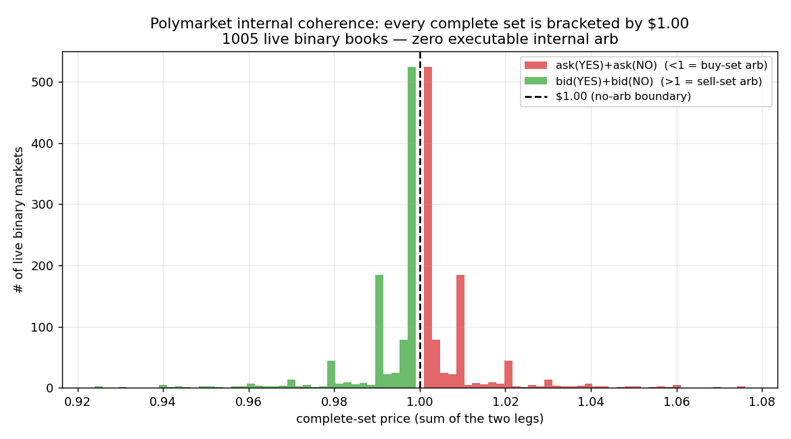

# Internal / NegRisk arbitrage — B3 validation

**Question:** Strategy B3: internal arbitrage is the single *largest documented* edge on
Polymarket — IMDEA (2025) measured **$39.6M extracted in a year** (NegRisk $29M +
single-condition YES+NO≠$1 $10.6M), but reported it ~99% bot-captured. Is any of it
capturable by a **non-latency** player — i.e. does executable internal arb exist on the
live books at snapshot granularity?

**Answer: No.** Across 1,005 live binary complete-sets and 40 NegRisk MECE sets, there is
**zero positive-net internal arbitrage** — not even gross, before fees. The books are kept
coherent to within ~a tenth of a cent by bots; the documented $39.6M is captured in
milliseconds and leaves nothing for anyone slower.

## Method

Two textbook risk-free internal arbs, checked on **live order books for both legs** (CLOB
`/books`), net of the per-leg taker fee (`feeRate·p·(1−p)`) with executable size from book
depth:
1. **Binary complete-set:** a YES+NO pair always redeems to exactly $1. Arb if
   `ask(YES)+ask(NO) < 1` (buy the set cheap) or `bid(YES)+bid(NO) > 1` (mint for $1, sell
   both legs).
2. **NegRisk MECE Dutch-book:** in a complete N-outcome set, exactly one resolves YES, so
   N−1 NO legs pay $1. Arb if `Σ ask(NO_i) < N−1` (buy all NO).

Universe: the 40 most-liquid NegRisk MECE events (2028 nominees, global elections, Fed,
AI-model, etc.) + the 104 most-liquid binary events. Code: `scan_internal_arb.py`.

## Findings



**1. Every complete set is bracketed by exactly $1.00.** Across 1,005 live binary books:

| | min | p10 | median | p90 | violations |
|---|---|---|---|---|---|
| `ask(YES)+ask(NO)` | 1.001 | 1.001 | **1.002** | 1.020 | **0 below $1.00** |
| `bid(YES)+bid(NO)` | — | — | **0.998** | — | **0 above $1.00** |

The buy-side sum never drops below \$1.001 and the sell-side sum never exceeds \$0.999.
The ~0.1–2¢ gap *is* the bid-ask spread — there is no daylight on the arb-relevant side.
This is the fingerprint of complete-set mint/merge bots enforcing no-arb to within the tick.

**2. Binary complete-set arbs (net > 0.1¢): 0 / 1,005.** Not one market is even *grossly*
mispriced (min ask-sum 1.001), let alone after fees.

**3. NegRisk Dutch-books: 0 executable.** Of 40 MECE sets, only **3 were even fully
quotable** — the other **37 had at least one leg with no NO ask at all**, so the Dutch-book
is *physically unexecutable* (you cannot buy a leg that has no offer). The 3 computable sets
(Fed July, Fed cuts 2026, Midterms) had gross edges of +0.1¢ / +0.7¢ / −3.3¢ — all
**net-negative** after summing the per-leg fees (N legs → N fee hits).

## Why it fails for a non-latency player

- **The edge is real but transient and infrastructure-gated.** Mint/merge and NegRisk
  convert make internal mispricing instantly arbitrageable; whoever sees it first (a bot,
  in ms) takes it. By the time it appears in a REST snapshot it is already gone. This is
  consistent with IMDEA's finding that the $39.6M accrued to a handful of bot accounts and
  that ~99% of opportunities were never captured (they closed too fast).
- **Fees punish multi-leg baskets.** Even a gross +0.7¢ Dutch-book (Fed cuts, N=13) goes
  net-negative once you pay taker fees on all 13 legs.
- **Illiquid legs make big Dutch-books unexecutable** regardless of speed (37/40 sets).

## Verdict

**B3 is not accessible without a low-latency execution bot, and even with one it is a
saturated arms race** against entrenched players for an edge that is ~99% pre-captured.
There is no *analysis* or *snapshot-speed* edge here. This is an engineering/latency
decision, not a research finding — and the bar to clear (build colocated streaming
execution to out-race existing bots) is far beyond a semi-automated operator.

This is the fifth consecutive corner where Polymarket proves efficient to the limit of
what's exploitable without infrastructure: the books are *coherent* (B3), and they are
*sharp* vs every real second price (World Cup, meteor, A1 Deribit, A2 Kalshi).

## Reproduce
```
python3 scan_internal_arb.py   # live both-leg book scan + no-arb band figure
```
(Requires `strategy_research/markets_snapshot.json` for the target list — regenerate via
`strategy_research/scan_markets.py`.)
