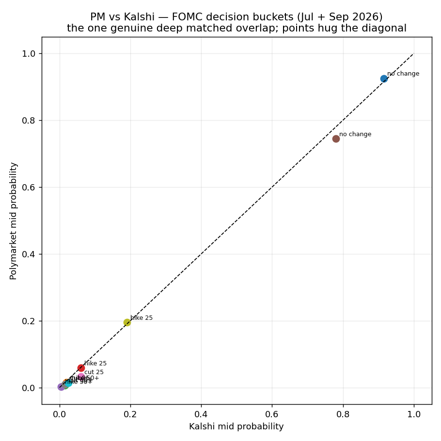

# Polymarket ↔ Kalshi cross-venue arbitrage — A2 validation

**Question:** Strategy A2: the *same* contract trades on Polymarket and Kalshi, both as
0–1 probabilities. When the same-definition contract diverges past combined costs, lock a
riskless cross-venue arbitrage. Does a tradeable edge exist?

**Answer: No.** The genuinely-matched, both-liquid, genuinely-uncertain intersection is
nearly empty. The one clean, deep, semantically-identical overlap (the FOMC rate decision)
prices the two venues within ~1pp on liquid buckets — and the best executable arb net of
both venues' fees is **+0.1¢ → 0.8%/yr** (on an unsizeable 0.7%-probability tail bucket);
every liquid bucket is **net-negative** after fees. The apparent overlaps elsewhere fail on
**resolution non-fungibility** or **one-sided liquidity**.

## Data

Kalshi public market-data REST (`api.elections.kalshi.com/trade-api/v2`, free, no auth):
series → events → markets with `yes_bid/ask_dollars` (already 0–1), `open_interest_fp`,
`rules_primary` (resolution text), `settlement_sources`. Polymarket from the cached scan +
live Gamma. Code: `fetch_kalshi.py`, `overlap_quality.py`, `compare_fed.py`.

## Findings

### 1. Kalshi is mostly an empty sports casino; the macro overlap is thin
Of ~120k open Kalshi markets, **~60k are auto-generated sports/parlay markets (`KXMVE*`)
with zero liquidity.** The non-sports, PM-overlapping universe (Economics, Crypto,
Politics, Financials, World) is a small minority, and most of its markets carry tiny open
interest. This matches the literature (Gebele & Matthes 2026: only ~6% of contracts have a
cross-platform counterpart).

### 2. Resolution non-fungibility kills the highest-frequency overlap (crypto)
Both venues run daily "Bitcoin above $K" ladders — but they are **not the same contract**:

| | Polymarket | Kalshi (KXBTCD/KXBTC) |
|---|---|---|
| Index | Binance BTC/USDT | **CF Benchmarks BRTI** (multi-exchange) |
| Time | 1-min close at **12:00 ET** | 60-sec avg before **5:00 PM EDT** |

Different reference index **and** a 5-hour settlement gap → a "lock" would carry index
basis + 5h of directional risk; it is not arbitrage. And the Kalshi daily-crypto side has
**~$0 resting liquidity** (penny-ask quotes only), so there is nothing to trade against
even if you accepted the basis risk. (Same lesson as the World Cup / meteor / A1 work:
apparent matches die on reading the exact resolution.)

### 3. The one genuine deep matched overlap — FOMC decision — is efficient
KXFEDDECISION resolves on the **actual Fed announcement** (identical semantics to PM),
both venues are liquid (Kalshi July OI ~226k contracts; PM "Fed Decision in July" $0.82M),
and bucket structure is identical (no change / cut 25 / cut 50+ / hike 25 / hike 50+).



The points hug the diagonal. Executable arb (buy YES cheap venue + buy NO dear venue),
net of PM taker (0.04·p·(1−p)) + Kalshi taker (0.07·p·(1−p)):

| meeting | bucket | PM mid | Kalshi mid | gap | net arb after fees |
|---|---|---|---|---|---|
| Jul | no change | 0.925 | 0.915 | +1.0pp | **−0.8¢** |
| Jul | hike 25 | 0.059 | 0.060 | −0.1pp | −1.6¢ |
| Sep | **no change** | 0.745 | 0.780 | **−3.5pp** | **−1.0¢** |
| Sep | hike 25 | 0.195 | 0.190 | +0.5pp | −2.7¢ |
| Sep | cut 25 | 0.033 | 0.060 | −2.7pp | +0.1¢ |

**Best executable net arb across all matched buckets: +0.1¢ (Jul "cut 50+"), capital
locked 48 days → 0.8%/yr** — below the risk-free rate, and on a ~0.7%-probability bucket
that cannot be sized. The largest *price* gap (Sept no-change, 3.5pp) is **net −1¢** once
you cross both books and pay both fees: PM ask 0.75 vs Kalshi bid 0.76 = ~1pp gross, eaten
by ~2pp combined fees.

### 4. Why it fails — the structural arithmetic
- **Two-sided fees.** A cross-venue lock is taker on *both* venues. Kalshi's quadratic fee
  (~1.75% max at p=0.5) + PM's (~1% politics) means the gap must exceed **~2–4pp + both
  spreads** just to break even. Persistent gaps that large are rare (literature: ~3¢ avg,
  decaying in ~30 min).
- **Capital lockup.** Matched markets with real gaps are months out (Sept FOMC = 48–98
  days), so even a hypothetical +1pp net annualizes to low single digits.
- **Operational reality for this user.** Capital must be split across venues (USDC on PM,
  USD/FCM on Kalshi); **Kalshi trading access from Norway is regulatorily fragile**
  (Spain/Germany already restricted), and funding it is a real friction. Data is free
  worldwide, but executing both legs is not.

## Verdict

**A2 fails the bar.** Cross-venue PM↔Kalshi arbitrage is not a tradeable edge for this
operator: the matched-and-liquid intersection is tiny (Fed), and there it is efficient to
within fees; the high-frequency overlap (crypto) is not fungible and is one-sided-empty;
two-sided fees + months-long lockup + fragile Norway access sink the rest. This corroborates
the literature directly (Gebele & Matthes 2026: cross-venue gaps are semantic
non-fungibility + capital frictions, not free money) and the project's running result —
**Polymarket is efficiently priced wherever a real, like-for-like second price exists.**

Revisit only if: a *new* category opens that is (a) semantically identical across venues,
(b) genuinely uncertain, (c) deep on both sides, and (d) short-dated — and even then, only
if the gross gap clears ~3–4pp after both fee schedules.

## Reproduce
```
python3 overlap_quality.py    # overlap map: resolution-source match + uncertainty/OI per series
python3 compare_fed.py        # the FOMC cross-venue arb computation + figure
# fetch_kalshi.py             # (optional) bulk active-market pull
```
