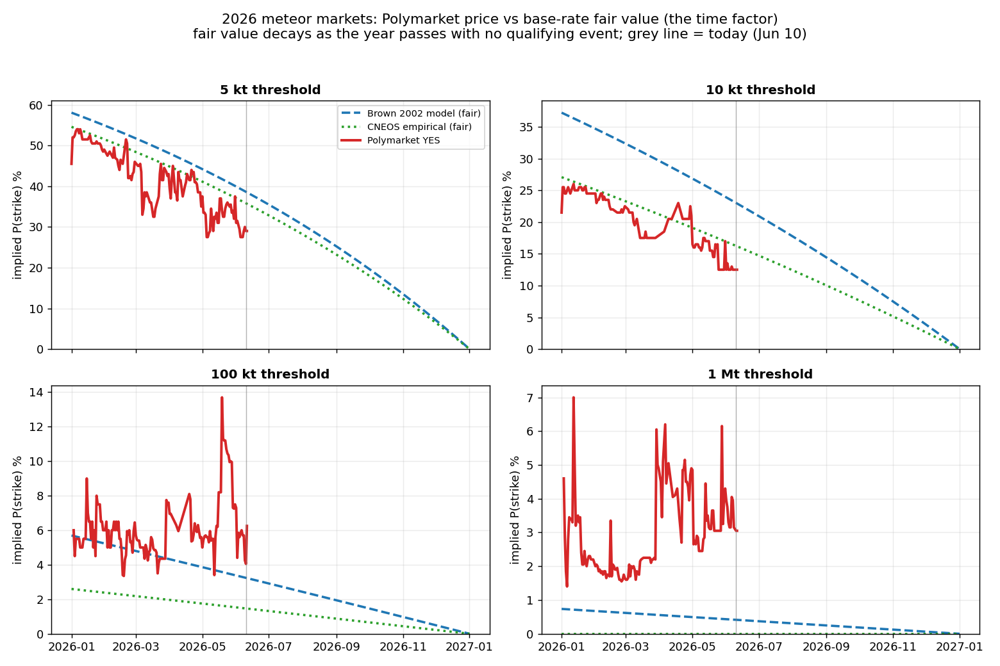
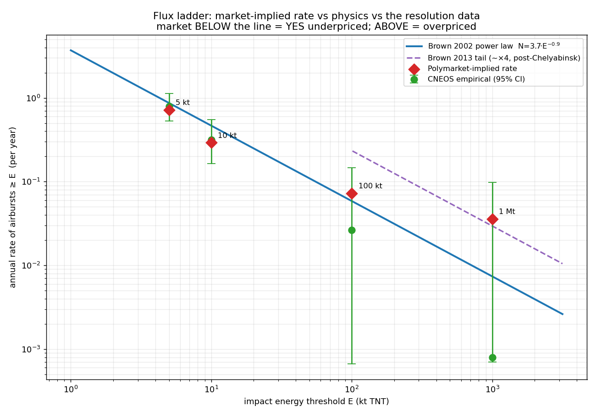

# Meteor-strike edge exploration — results

**Question:** Are Polymarket's 2026 meteor-strike markets ("a ≥ X kt natural airburst in
2026?") mispriced enough to trade? These were the only "impossible-event" markets with an
*objective* resolution source — the NASA/CNEOS fireball database — so they're the one
corner where a real second number exists to check the price against.

We compare three independent estimates of the **annual airburst rate** at four energy
thresholds (5 / 10 / 100 / 1000 kt):

1. **Market** — backed out of Polymarket's live YES price as a constant Poisson rate
   (`λ = −ln(1−p)·365/days_left`).
2. **Empirical** — the CNEOS fireball record 1988–2025 (the market's own resolution
   source), with exact Poisson 95% CIs. *Data-starved at the tail (1 and 0 events).*
3. **Model** — the **Brown et al. (2002)** bolide impact-flux power law
   `N(>E) = 3.7·E^−0.9`, calibrated on the full size–frequency distribution (so it
   constrains the tail far better than a couple of direct hits). The **Brown (2013)**
   post-Chelyabinsk tail enhancement (~×4 above 100 kt) is shown as a sensitivity.

As of 10 Jun 2026 the largest 2026 airburst is **1.1 kt** — nothing has resolved YES, so
fair value is P(≥1 event in the *remaining* window) and decays as the year runs out.

---

## 1. The time factor — price vs decaying fair value



Each market opens near the full-year probability and **decays mechanically** as the
calendar passes with no strike (the 5 kt market fell from ~46% in January to 29% now).
The market price (red) tracks the *shape* of the fair-value decay closely all year. The
**gap is persistent, not converging**: at 5 kt and 10 kt the red line sits *below* fair
value the whole year (YES mildly underpriced); at 100 kt and 1 Mt it sits *above* the
Brown-2002 fair curve (tail apparently overpriced). That stable crossover is the classic
favorite–longshot fingerprint.

## 2. The flux ladder — where the market sits vs physics



This is the decisive chart. Plotting the implied annual rate against energy:

- **5 kt & 10 kt:** the market diamonds land essentially **on** both the power law and the
  empirical points — slightly low, but inside the data's confidence bars.
- **100 kt & 1 Mt:** the market sits **above the Brown-2002 line** (the "overpricing" the
  time-series hinted at) — **but right on the Brown-2013 tail-enhanced curve.** The market
  is not naively overpricing the tail; it is pricing the *modern, post-Chelyabinsk* flux,
  which the short 38-year direct-hit record badly under-samples (note the empirical 100 kt
  / 1 Mt error bars span two orders of magnitude).

## Numbers

| Threshold | Market YES (now) | Market rate /yr | Empirical /yr (95% CI) | Brown 2002 /yr | Model fair YES (now) | vs Brown 2002 |
|---|---|---|---|---|---|---|
| 5 kt  | 29.0% | 0.715 | 0.79 [0.53, 1.13] | 0.869 | 38.6% | underprices |
| 10 kt | 12.5% | 0.292 | 0.32 [0.16, 0.55] | 0.466 | 23.0% | underprices |
| 100 kt | 6.2% | 0.073 | 0.026 [0.00, 0.15] | 0.059 | 3.2% | overprices* |
| 1 Mt  | 3.0% | 0.036 | 0.00 [0.00, 0.10] | 0.0074 | 0.4% | overprices* |

\* relative to **Brown 2002**; both tail points are ≈ fair against **Brown 2013**.

---

## Conclusion

**No robust, tradeable edge — the ladder is impressively well-calibrated to impact
physics.** Two specific findings:

1. **The tail "overpricing" is not an edge.** Against the naive empirical record (1 and 0
   events) the 100 kt and 1 Mt markets look overpriced — the original NO-short thesis. But
   against the Brown-2013 flux model, which is the better physical estimator at the tail,
   those same prices are ≈ fair. A NO-short there only profits if you trust the sparse
   38-year count over the modern flux model — i.e. it's a bet *against* the better physics.

2. **The only persistent, model-*and*-data-supported lean is the opposite trade:**
   5 kt / 10 kt YES looks mildly **under**priced (market rate 0.72 / 0.29 vs Brown 0.87 /
   0.47 and empirical 0.79 / 0.32), consistently across the whole year. The public reads
   "meteor strike" as a damaging impact and prices it scared-low, while the resolving
   database logs ~one multi-kiloton high-altitude airburst per year (mostly over ocean /
   remote, barely newsworthy). But the lean is **within the base-rate CI**, it is
   **contrarian to the meme thesis** (you'd buy YES), and — decisively — **liquidity is
   under ~$15k across the entire ladder** (5 kt order book ≈ $1.2k), so it cannot be sized.

**Future opportunity?** Structurally the markets reopen every year and decay predictably,
so the *cleanest* version of any play is to act at the January open (buy YES on the low
thresholds if they reopen scared-low, or short the tail only if it reopens above the
Brown-2013 curve). But the edge, where it exists at all, is small, statistically marginal,
and liquidity-capped. This closes the meteor corner consistently with the rest of the
project: **Polymarket is efficient even here.**

---

## Reproduce

```
python3 "meteor_analysis.py"
```

Pulls CNEOS (`ssd-api.jpl.nasa.gov/fireball.api`) and Polymarket CLOB price history live,
regenerates both figures and `comparison.csv`. ~30s.

**Files:** `meteor_analysis.py` (all code) · `fig_timeseries.png` · `fig_flux_ladder.png`
· `comparison.csv`

**Caveats:** CNEOS logs only US-government-sensor detections (subset, some reporting lag);
impact-energy estimates carry ~×2 uncertainty near a threshold; the power-law slope/normalization
and the 2013 tail factor are themselves uncertain. Not financial advice.
